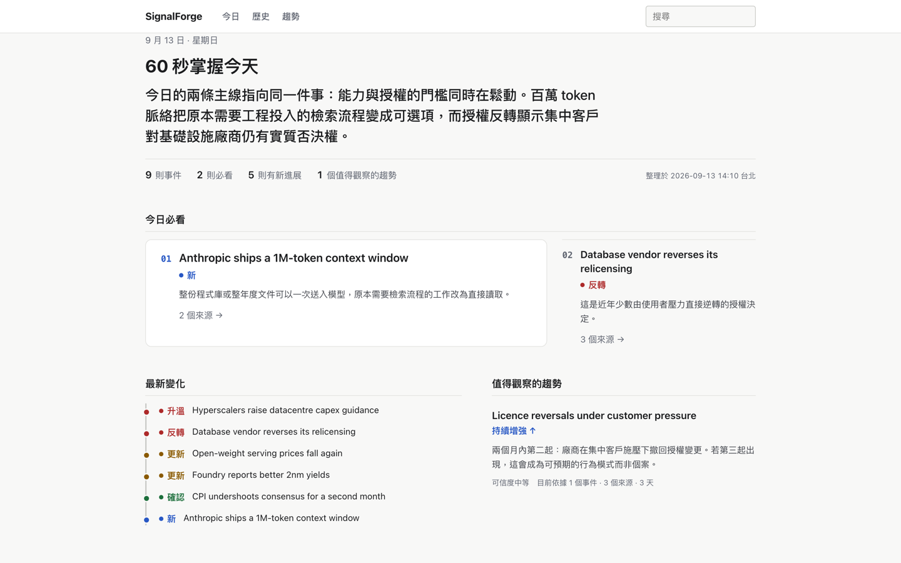

# SignalForge

> SignalForge reads the noise so you can read the signal.

Built and run daily by [Oliver Yu](https://meowcoder.com). My own instance
is readable at [signal.meowcoder.com](https://signal.meowcoder.com) — the
Today page, the archive and the signals, exactly as the pipeline publishes
them. The design decisions behind it are written up as a
[case study](https://meowcoder.com/work/signalforge/).

Self-hosted personal intelligence system that turns noisy multi-source
information into **events, changes, emerging signals, and a source-grounded
daily brief** — and shows you, in ten seconds, what actually matters today.



*Synthetic demo data (`pnpm demo`). The real thing looks the same with your sources.*

## Why SignalForge

A feed reader gives you today's articles. That is the wrong unit.

```text
5 articles about the same release
  → 1 Story
  → what actually changed today
```

Five outlets writing about one release is one event, not five things to read.
An article published today is frequently not new information — it is commentary
on something you were told last week, a rumour that has now been confirmed, or
a number that moved in a direction you were already tracking. Sorting that out
is the work, and it is the work a summarizer does not do: summarizing five
articles gives you five summaries.

SignalForge is **event-centric, not article-centric**. Every story persists in a
ledger, so today is compared against what was already known and recorded as one
of:

| | |
|---|---|
| `NEW` | First time this event has been seen |
| `UPDATE` | Genuinely new detail on a known story |
| `ESCALATION` | The situation got more serious |
| `RESOLUTION` | It concluded |
| `REVERSAL` | It went the other way |
| `CONFIRMATION` | A rumour or single-source report is now corroborated |
| `RUMOR` | Reported, but not yet from a source that settles it |
| `NO_MATERIAL_CHANGE` | Coverage happened; information did not |

A story marked `NO_MATERIAL_CHANGE` is kept in the ledger and out of your
brief. That is the difference between tracking events and summarizing articles.

## What you get each morning

The Today page is built to be read in layers:

| In | You see |
|---|---|
| 10 seconds | The date, a two-sentence *Today in 60 seconds*, and the counts: stories, must-know, updates, signals |
| 60 seconds | **Must Know** — three to five ranked cards: title, importance, change type, one line on why it matters, source count |
| 5 minutes | **What Changed** (escalations, reversals, updates), the strongest **Emerging Signal**, and every section as compact rows |
| When it is worth it | A story's full *what happened / why it matters / what changed / impact*, its facts, sources and cross-day timeline |

Items that arrived after the morning run are an inbox at the bottom, not
intelligence at the top. The full long-form brief is one click away and is what
the archive keeps.

## Core capabilities

- **Multi-source collection** — RSS (via Miniflux), GitHub, Hacker News, arXiv,
  Semantic Scholar, Reddit, YouTube, SEC EDGAR, FRED, CoinGecko, plus scheduled
  web research. Most connectors are optional.
- **Event-centric deduplication** — items are clustered into stories; duplicate
  coverage becomes supporting sources, not extra entries.
- **Cross-day story ledger and change tracking** — the eight change types above,
  judged against history rather than in isolation.
- **Emerging signal detection** — weak repeated patterns tracked across days
  before any single day would justify a story.
- **Source-grounded writing** — every source id in a brief resolves to a
  collected item and every number is read back from a structured fact store;
  fabricated references fail validation.
- **Deterministic validation** — a brief is checked by code, not by asking a
  model whether it did a good job.
- **Separate Curator and Editor sessions**, tool-only structured output, a
  restricted agent runtime (no shell, no filesystem, no credentials), and a
  model-provider fallback chain.
- **Production observability** — per-collector health, per-item decision
  traces, run state, and a reason for every rejection.
- **A web reader** — Today dashboard, full briefs, story deep dives, history,
  signals, search. No model runs on a request; every route is read-only.
- **Unattended daily runs** — macOS LaunchAgent included; any scheduler works.

## Quick start

```bash
git clone https://github.com/tc3oliver/signalforge.git && cd signalforge
pnpm install                             # also installs web/, via postinstall

cp .env.example .env
# Edit .env: replace the placeholder password with a locally generated one, in
# BOTH POSTGRES_PASSWORD and DATABASE_URL.

docker compose up -d                     # Postgres 17 + pgvector, 127.0.0.1 only
pnpm db:migrate
pnpm setup:check                         # read-only: what is ready, what is missing
```

### See it work before configuring anything

```bash
pnpm demo                                # synthetic three-day history, "web-dev" lineage
DI_LINEAGE=web-dev pnpm run web:start    # then open http://127.0.0.1:3300
```

`pnpm demo` needs no model, no API key and no network. It writes into its own
lineage and can never touch `default`. `examples/` has the same output as static
files if you would rather just read it.

### Then make it yours

```bash
cp config/interests.yaml   config/interests.local.yaml
cp config/watchlists.yaml  config/watchlists.local.yaml
$EDITOR config/interests.local.yaml      # your topics, your weights
```

Every `config/*.yaml` in the repository is a **shipped example**. The file that
actually runs is `*.local.yaml`, gitignored, and it wins outright when present.

One thing to know before you spend an evening on it: the **watchlists** decide
what the collectors fetch and are used on every run. The **interest profile**
reaches both agents — its topics and weights are rendered into the Curator's and
the Editor's system prompts as **priors, not filters**. A weight raises or lowers
a story's relevance and can move it earlier in the brief. It never excuses an
item from being decided, never turns "off-topic" into `IRRELEVANT`, and never
drops a high-importance story that no topic happens to name: a serious outage or
vulnerability reaches you whichever topics you listed.

What the model does with those priors is judgement, not arithmetic. See the
personalization entry under [Limitations](#limitations) for what that does and does not
guarantee.

Then point `config/agent.yaml` at a model provider the installed Pi agent can
authenticate as (`pi models`, `pi auth check`), add whatever collector
credentials you want to `~/.config/daily-intelligence/secrets.env`, and run:

```bash
pnpm collect                             # collection only; reports each source's health
pnpm daily                               # the full day, ending in a published brief
pnpm web:start                           # http://127.0.0.1:3300
```

Prerequisites: Node ≥ 24, pnpm 10, a Docker-compatible runtime, and
`@earendil-works/pi-coding-agent` 0.85.1 installed and authenticated.
`docs/ENVIRONMENT.md` records the versions this was verified against.

## Architecture

```text
Sources ──▶ Collectors ──▶ Normalized items (UNTRUSTED_EXTERNAL_CONTENT)
                                  │
                                  ▼
                        Pi Curator session ── deduplicate · cluster events
                                  │           compare history · judge novelty
                                  ▼           select material
                           Story Ledger (Postgres)
                                  │
                                  ▼
                        Fresh Pi Editor session ── writes from materials only
                                  │
                                  ▼
                     Deterministic validator ── source ids · fact refs · shape
                                  │
                                  ▼
                        Daily Brief ──▶ Web reader (read-only, no model)
```

Two agent sessions, never one: the Curator sees the day's raw items and decides
what is a story and what changed; the Editor sees only the curated materials and
writes. Both are restricted runtimes with tool-only output, every collected item
is marked untrusted before an agent sees it, and a brief that references a
source or fact that does not exist is rejected by code. Durable state is
Postgres; the same rows feed the pipeline and the reader.

Why it is shaped this way, and where each guarantee is enforced:
[`docs/ARCHITECTURE.md`](docs/ARCHITECTURE.md).

## Model providers and credentials

The model chain lives in `config/agent.yaml`; the first entry is the primary
and each later one a fallback. `provider` is whatever the installed Pi agent
can authenticate as.

**Model authentication is Pi's, not this project's.** SignalForge reads Pi's
existing logins read-only and never stores a model credential of its own. A
direct API key, a subscription login, or a self-hosted OpenAI-compatible
endpoint all work the same way here; whether one is reachable is a question for
`pi auth check`.

**Collector credentials are SignalForge's**, and live outside the repository
in `~/.config/daily-intelligence/secrets.env`, the environment, or the macOS
Keychain. Every connector that needs one reports `DISABLED` without it and the
run continues; running with no credentials at all is supported.

Which is which, and where each goes: [`docs/CREDENTIALS.md`](docs/CREDENTIALS.md).

**Budget for volume, not for requests.** The curator scans *every* item
collected that day — on a busy day well over a thousand — because a story that
is never looked at cannot be judged. Cost scales with how much you collect, not
with how much reaches your brief. Price the primary model accordingly.

## Security model

- **External content is untrusted.** Everything collected is marked as such
  before an agent sees it. Prompt injection through a collected item is an
  in-scope vulnerability.
- **The agent runtime is restricted.** No shell, no filesystem beyond one
  narrowly-rooted policy reader, no arbitrary HTTP, no credentials. Asserted per
  run, not just configured.
- **The agent never holds a credential.** Collectors and the research layer run
  server-side and hand the agent content, never keys.
- **The reader is local and read-only.** Postgres and the web app bind
  `127.0.0.1` by default. `/admin` is off unless `SIGNALFORGE_ADMIN=1`. No
  remote fonts, scripts or stylesheets; a strict CSP is set on every response.
- **Third-party providers are a trust boundary.** Item text goes to whichever
  provider you configure, under their terms.

Threat model, and the code and tests that enforce each line:
[`docs/SECURITY.md`](docs/SECURITY.md). Reporting: [`.github/SECURITY.md`](.github/SECURITY.md).

## Limitations

Stated plainly, because they determine whether this is worth your time.

- **Single-user, self-hosted.** One reader, one database, no authentication in
  front of the reader. Multi-user is not a roadmap item.
- **Brief quality is bounded by your model and your source coverage.** The
  pipeline is deterministic where it can be; the judgement is not. A weaker
  primary model produces a visibly weaker brief.
- **The curator is expensive by design.** Scanning every item is the product
  requirement that makes historical comparison possible, and it is also the
  single largest cost. A cheap screener now reads each item once so the
  expensive Curator's pages hold only what survived; every item is still
  accounted for, and a screened-out item stays searchable and rescuable.
- **Personalization is v1: priors, not learning.** The interest profile does
  reach both agents, topic attributions are persisted on each story, and each
  brief records the profile version that shaped it. What that does *not* give
  you: nothing learns from what you actually read, there is no feedback loop,
  no automatic tuning of your weights, and no measurement yet of whether the
  profile is working. The weights are instructions to a model, so it may not
  respect their relative ordering — they influence ranking and relevance, they
  do not deterministically guarantee the order stories appear in. Tuning them
  is manual and stays manual.
- **Historical value requires an accumulated ledger.** A fresh install has no
  history, so everything is `NEW` for the first few days and change tracking
  only becomes useful once days accumulate.
- **Several connectors are optional and off by default**, so a default install
  sees much less than a configured one.
- **Unattended scheduling as shipped is macOS-only** (a LaunchAgent). On
  another platform, drive `pnpm daily` from whatever scheduler you have.
- **Emerging signal detection is the least mature part** of the pipeline and the
  part most likely to change.
- **Not supported.** Published because the design may be useful to read and
  adapt, not because anyone is on call. See [`CONTRIBUTING.md`](CONTRIBUTING.md).

What comes next for the intelligence layer — a deterministic history invariant,
claim-level grounding, a feedback loop, and measuring whether the shipped
personalization actually changed what you read — is specified with evidence and
acceptance criteria in
[`docs/INTELLIGENCE_BACKLOG.md`](docs/INTELLIGENCE_BACKLOG.md), each item
carrying a `PLANNED` / `SHIPPED` / `DEFERRED` status.

## Where it stands

`pnpm verify` is the command that decides whether a change is good: typecheck,
the full suite with **no suite permitted to skip**, and the web build. CI runs
it against a real Postgres and fails if any test skipped.

- **Synthetic acceptance:** passes every gate on all three fixture days —
  `docs/reports/PHASE1_REPORT.md`.
- **Stability:** three independent lineages, core story selection 0.922 against
  a 0.85 gate — `docs/reports/STABILITY_REPORT.md`.
- **Model fallback:** validated live with a quota failure injected at the
  worker boundary; a fresh session on the second model finished the run.
- **Live runs:** real end-to-end days through the installed scheduler —
  `docs/reports/LIVE_RUN_REPORT.md`.
- **Honest self-assessment:** `docs/reports/QUALITY_REVIEW.md` is a critical
  review of this project by its own author, scoring intelligence quality well
  below engineering quality and saying why. Read it before deciding this is
  finished software.

> **A note on the name.** The project is SignalForge; several internal
> identifiers still say `daily-intelligence` — the Docker project and volume,
> the database name, the secrets-file directory, the scheduler labels. Renaming
> the Compose project orphans the data volume and renaming the secrets directory
> breaks an existing install, so they are deliberately left alone.

## Documentation

| Document | One line |
|---|---|
| [`AGENTS.md`](AGENTS.md) | The binding project rules; read this first |
| [`docs/ARCHITECTURE.md`](docs/ARCHITECTURE.md) | Why the system is shaped this way, and where each guarantee is enforced |
| [`docs/CREDENTIALS.md`](docs/CREDENTIALS.md) | Model auth (Pi's) versus collector credentials (yours), and where each lives |
| [`docs/SECURITY.md`](docs/SECURITY.md) | Threat model and the code and tests that enforce it |
| [`docs/DATA_SOURCES.md`](docs/DATA_SOURCES.md) | Per-collector endpoints, credentials, incrementality and current status |
| [`docs/OPERATIONS.md`](docs/OPERATIONS.md) | Day-to-day operation of the running system |
| [`docs/RUNBOOK.md`](docs/RUNBOOK.md) | Incident procedures |
| [`docs/DEVELOPMENT.md`](docs/DEVELOPMENT.md) | Running, testing, fault injection, run artifacts, inspecting a failed run |
| [`docs/ENVIRONMENT.md`](docs/ENVIRONMENT.md) | Verified versions, model IDs, config surface and environment variables |
| [`docs/INTELLIGENCE_BACKLOG.md`](docs/INTELLIGENCE_BACKLOG.md) | The next intelligence changes, with evidence, design and acceptance criteria |
| [`web/README.md`](web/README.md) | The reader: routes, the no-LLM rule, and how untrusted content is rendered |
| [`CONTRIBUTING.md`](CONTRIBUTING.md) | What kind of change is welcome, and how to verify one |

Dated evidence — acceptance, live runs, the stability measurement, the quality
review and the P0 fixes — lives under
[`docs/reports/`](docs/README.md#reports--point-in-time-not-maintained) and is
deliberately never updated after the fact.

## Design notes

The decisions behind the pipeline — why the unit is the event rather than
the article, why numbers travel as fact ids and are validated by code, and
why the Curator/Editor split, the restricted runtime and the model-free
reader are enforced structurally — are written up in one article
(Traditional Chinese):
[SignalForge 的三個設計決策](https://study.meowcoder.com/posts/260915-signalforge-design-decisions/).
The English overview is the [case study](https://meowcoder.com/work/signalforge/).

## License

MIT — see [`LICENSE`](LICENSE).

The code is mine to license. What the pipeline *collects* is not: items come from
Hacker News, GitHub, arXiv, RSS feeds, FRED, CoinGecko and others, each under its
own terms, and a published brief quotes and links them. Nothing collected is
redistributed here — `runs/`, `briefs/` and `logs/` are gitignored, and the test
data committed under `experiments/` and `fixtures/` is synthetic. If you run this,
the collected content is yours to be responsible for.

Repository topics, for anyone cataloguing this: `ai`, `agents`, `llm`,
`intelligence`, `news-aggregator`, `rss`, `self-hosted`, `daily-brief`,
`knowledge-management`, `typescript`, `postgresql`.
